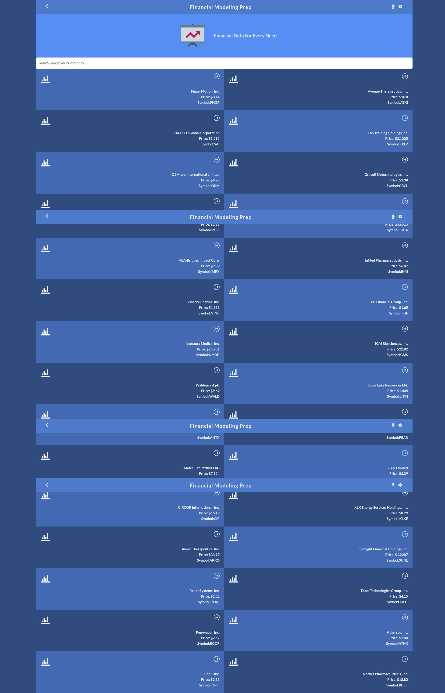
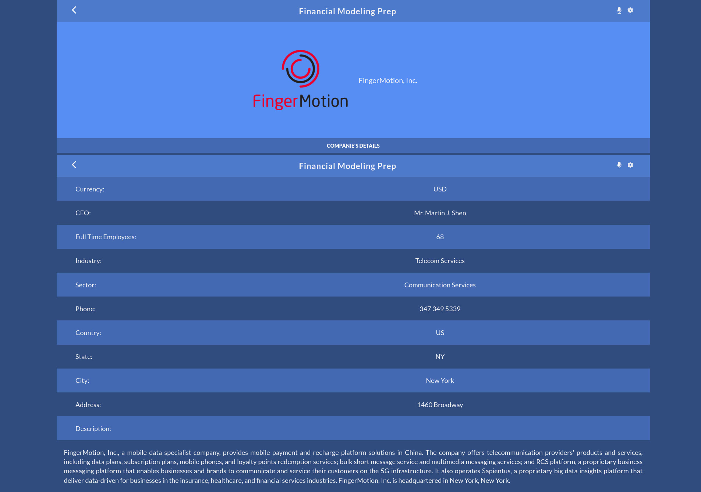

# Financial Modeling App
Financial Modeling App is a mobile web application that shows financial data.
Users can filter data by any parameter, when a user clicks on a specific company the app will take 
you to another page to show specific data about that company.
    
## Built With

- HTML
- CSS
- JavaScript
- React
- Redux
- React Router

## Full Screen Views


  
## Learning objectives
- Use React documentation.
- Use React components.
- Use React props.
- Use React Router.
- Connect React and Redux.
- Handle events in a React app.
- Write integration tests with a React testing library.
- Use styles in a React app.
- Use React life cycle methods.
- Apply React best practices and language style guides in code.
- Use store, actions and reducers in React.


## Instructions

First clone this repository.
```bash
$ git clone https://github.com/LuisSalas94/financial-modeling-app
```

Install dependencies. Make sure you already have [`nodejs`](https://nodejs.org/en/) & [`npm`](https://www.npmjs.com/) installed in your system.
```bash
$ npm install # or yarn
```

Run it
```bash
$ npm start # or yarn start
```

## Live Demo

[Live Demo Link](https://financial-modeling.netlify.app/)


## Author 👤

- GitHub: [@LuisSalas94](https://github.com/LuisSalas94)
- LinkedIn: [Fernando Salas](https://www.linkedin.com/in/luisfernandosalasgave/)
- Medium: [Fernando Salas](https://medium.com/@luisfernandosalasg)

## 🤝 Contributing

Contributions, issues, and feature requests are welcome!
Feel free to check the [issues page](../../issues/).

## Acknowledgments 📚 
Original design by [Nelson Sakwa on Behance](https://www.behance.net/sakwadesignstudio)

## Show your support

Give a ⭐️ if you like this project!

## 📝 License

This project is [MIT](./MIT.md) licensed.
